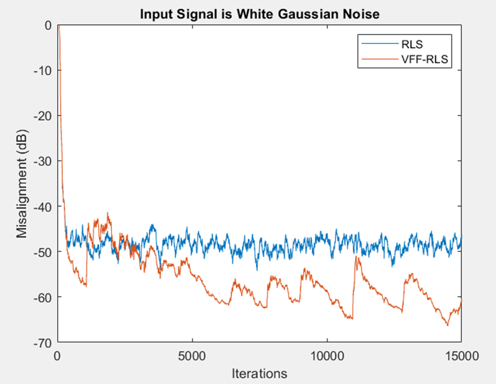
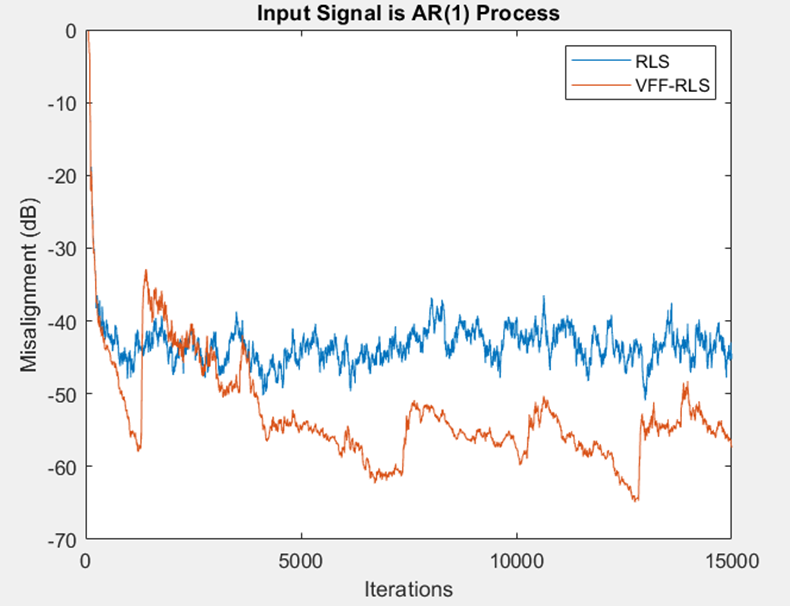

# VFF-RLS Algorithm for System Identification

This is the MATLAB implementation of the **Variable Forgetting Factor Recursive Least-Squares (VFF-RLS)** algorithm, as described in the paper:  
**[A Robust Variable Forgetting Factor Recursive Least-Squares Algorithm for System Identification](https://ieeexplore.ieee.org/document/4639569)** by Constantin Paleologu, Jacob Benesty, and Silviu Ciochină.

The project reproduces the results of the paper, demonstrating the performance of the VFF-RLS algorithm in system identification tasks, particularly in the presence of noise and abrupt system changes.

This project is part of the course **[Adaptive Learning, Estimation And Supervision Of Dynamical Systems](https://unibg.coursecatalogue.cineca.it/insegnamenti/2024/8244_43621_16329/2021/8244/89?coorte=2023&schemaid=77316)** in the master's degree program in **Computer Engineering**.

---

**Course Overview**:
During the Adaptive Learning, Estimation, And Supervision Of Dynamical Systems course, we dived into many topics like:
- Recursive and Adaptive Estimation
- Closed-Loop Identification
- Subspace Identification
- Supervision and Diagnosis

This project aims to study and reproduce the results of the paper mentioned above, which is related to Recursive and Adaptive Estimation.

---

## Table of Contents
1. [Project Overview](#project-overview)
2. [Problem Statement](#problem-statement)
3. [Algorithms](#algorithms)
4. [Implementation](#implementation)
5. [Results](#results)

---

## Project Overview

The goal of this project is to implement and evaluate the **VFF-RLS algorithm** for system identification. The algorithm improves upon the classical Recursive Least-Squares (RLS) method by dynamically adjusting the forgetting factor λ based on the system noise and error signal. This allows for better tracking of system changes and improved robustness to noise.

Key features of the project:
- Implementation of both **RLS** and **VFF-RLS** algorithms.
- Simulation of system identification with **white Gaussian noise (GWN)** and **AR(1) process** input signals.
- Introduction of abrupt system changes to test tracking capabilities.
- Visualization of results, including misalignment, forgetting factor evolution, and condition number.

---

## Problem Statement

The problem addressed in this project is **system identification** in the presence of noise. The goal is to estimate the impulse response of an unknown system using an adaptive filter. The system is modeled as a **FIR filter** with an impulse response h, and the output is corrupted by additive noise.

### System Model
- **Input Signal**: $$\mathbf{x}(n)$$ (white Gaussian noise or AR(1) process).
- **Output Signal**:  
  $$y(n) = \mathbf{h}^T \mathbf{x}(n) + v(n)$$
  where:
$$\mathbf{x}(n) = [x(n), x(n-1), \dots, x(n-M+1)]^T \text{ is the input vector.} \quad v(n) \text{ is additive white Gaussian noise.}$$

### Challenges
- $$\text{Noise } v(n) \text{ corrupts the output.}$$
- Trade-off between tracking speed and stability in adaptive filtering.

---

## Algorithms

### 1. Recursive Least-Squares (RLS)
- Classical RLS algorithm with a fixed forgetting factor λ.
- Provides a baseline for comparison with VFF-RLS.

### 2. Variable Forgetting Factor RLS (VFF-RLS)
- Forgetting factor $$λ(n)$$ is adjusted dynamically based on the system noise and error signal.
- Ensures fast tracking during system changes and low misadjustment in steady-state.
- Key equations:
  $$\lambda(n) = \min\left(\frac{\sigma_q(n) \sigma_v}{\sigma_e(n) - \sigma_v}, \lambda_{\text{max}}\right)$$
  where $$\sigma_e(n)$$, $$\sigma_q(n)$$, and $$\sigma_v$$ are power estimates.

---

## Implementation

The project is implemented in **MATLAB**. The main script (`main.m`) performs the following steps:
1. Generates input signals (white Gaussian noise and AR(1) process).
2. Simulates the unknown system using a FIR filter.
3. Adds noise to the output to create the desired signal.
4. Implements RLS and VFF-RLS algorithms to estimate the system impulse response.
5. Plots the results, including misalignment, forgetting factor evolution.

### Files
- `main.m`: Main script for running simulations and generating results.
- `rls_fun.m`: Implementation of the RLS algorithm.
- `vff_rls.m`: Implementation of the VFF-RLS algorithm.

---

## Results

 

The results demonstrate the performance of the VFF-RLS algorithm compared to the classical RLS method. Key observations:
- **Misalignment**: VFF-RLS achieves lower misalignment and faster convergence.
- **Forgetting Factor**: λ(n) adapts dynamically to system changes.
- **Condition Number**: The algorithm maintains numerical stability.

### Example Plots
1. **Misalignment Comparison**: RLS vs VFF-RLS for white Gaussian noise and AR(1) process inputs.
2. **Evolution of Forgetting Factor**: λ(n) over iterations.

